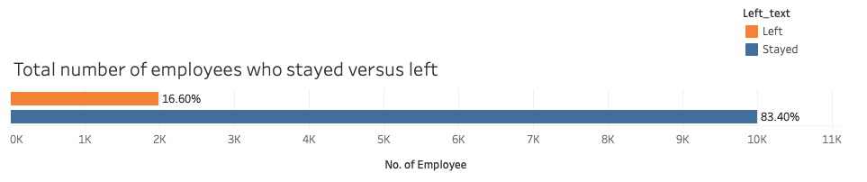

# Decision Tree Classification of Salifort Motors' Employees
## Overview
This project aimed to create a decision tree, random forest, and XGBoost model to predict whether an employee will stay or leave the Salifort Motors company. This project utilized a dataset called [HR_capstone_dataset.csv](data/HR_capstone_dataset.csv), which contains information about employees who worked at Salifort Motors company. The final champion decision tree classification model performed with 94% accuracy and 91% recall, determining what features were most important in determining whether an employee would stay or leave the company. Based on the model, the number of assigned projects, last evaluation scores, tenure of work, and whether an employee is overworked (>170 hours per month) or not were most influential in determining whether an employee left or stayed with the company. [Overview of the features mentioned above, comparing between those who stayed versus left, can be found on Tableau Public.](https://public.tableau.com/shared/QFGXJQRTY?:display_count=n&:origin=viz_share_link)

## Business Understanding
According to insights from vervoe.com, the average cost of hiring an employee in the US is approximately $4,700, and it typically takes around 6.2 months to train a new employee to reach full productivity. Therefore, retaining current employees and reducing high turnover rates can significantly mitigate the additional costs and time associated with hiring and training new staff. Developing a machine learning classification model to predict the likelihood of employee attrition could be instrumental in identifying at-risk employees and implementing targeted retention strategies.

## Data Understanding
The data consisted of 11,991 unique employees and 10 features. The features included information on employees' satisfaction level, last evaluation scores, number of assign projects, average monthly working hours, tenure of work, whether or not employee experienced an accident, whether or not employee left the company, whether or not the employee was promoted in the last 5 years, the employee's department and the employee's salary. The bar graph below shows how many employees stayed or left the company in the data set.

## Modeling and Evaluation

## Conclusion
